# Frontend gap fixes — before and after

Visual evidence for the four frontend gaps fixed alongside these images. Every
shot is the seeded development site (`pnpm seed:dev`) captured in Chromium at
1280px and 390px, full page.

---

## 1. Featured images were never displayed

`article.tsx` and `post-list.tsx` contained no `` at all, so post pages and
every list and grid rendered text-only even though the migration preserves
featured images and alt text.

### Home page — desktop

| Before                                                                                                                                                                                         | After                                                                                                                                                                                                           |
| ---------------------------------------------------------------------------------------------------------------------------------------------------------------------------------------------- | --------------------------------------------------------------------------------------------------------------------------------------------------------------------------------------------------------------- |
| 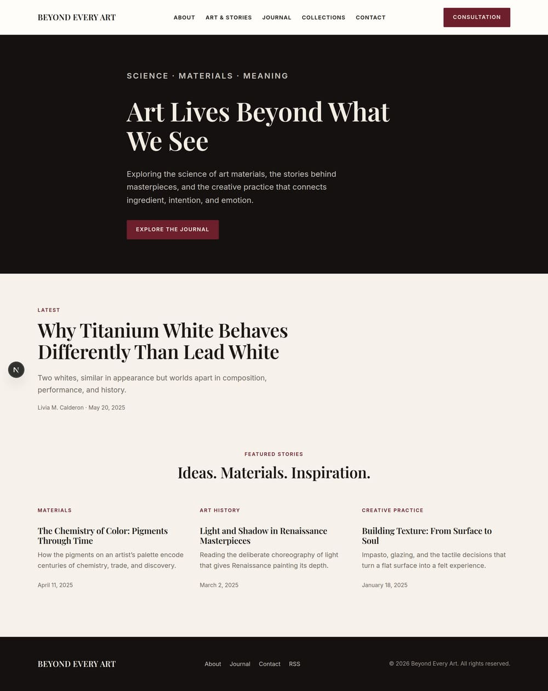 | 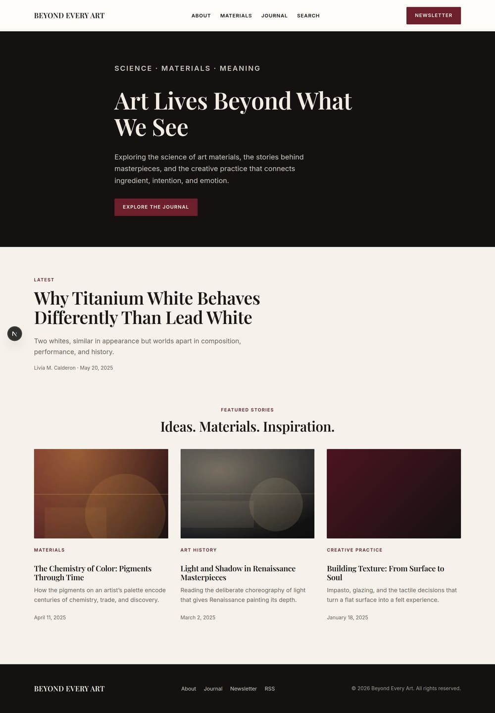 |

### Post page — desktop

| Before                                                                                                                                                      | After                                                                                                                                                                                     |
| ----------------------------------------------------------------------------------------------------------------------------------------------------------- | ----------------------------------------------------------------------------------------------------------------------------------------------------------------------------------------- |
| 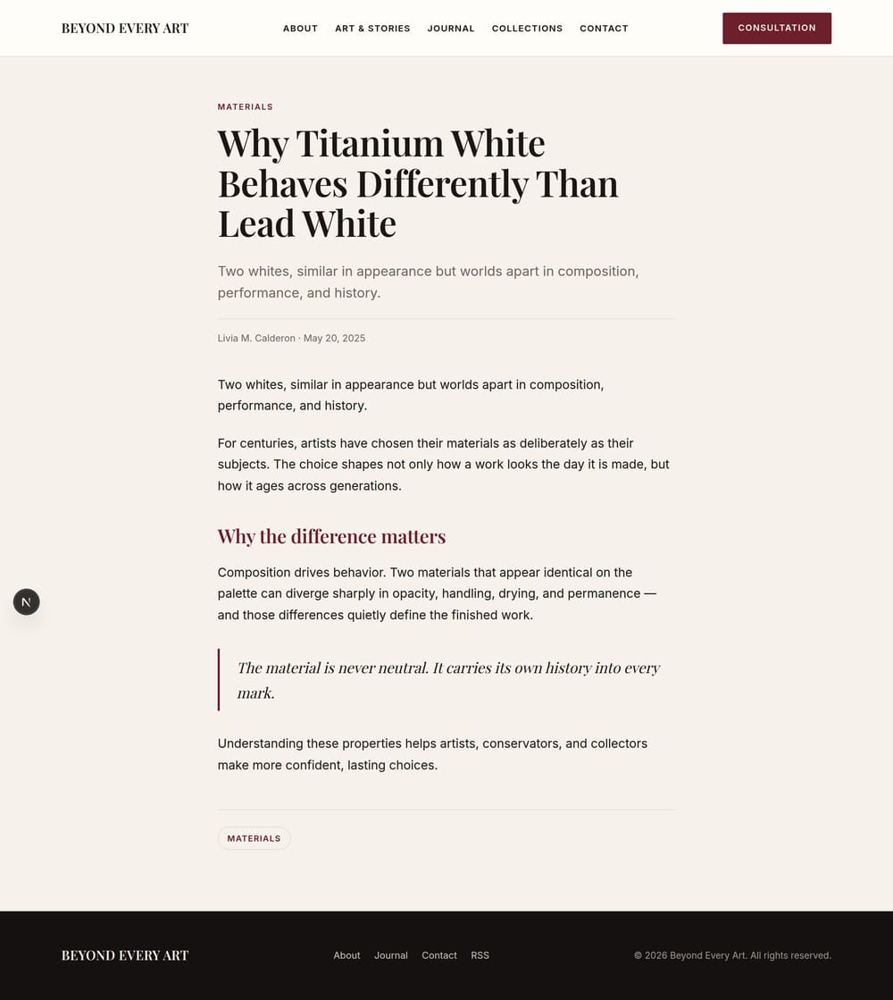 | 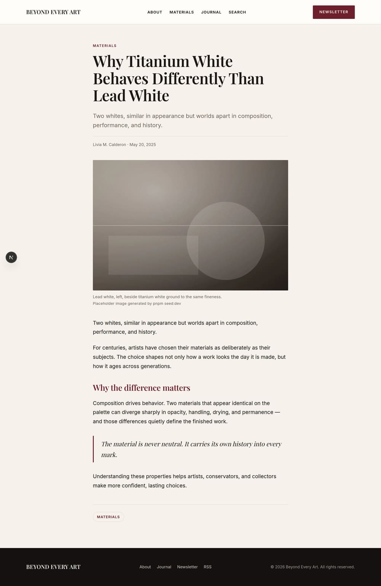 |

### Post page — mobile

| Before                                                                                     | After                                                                                                                                                |
| ------------------------------------------------------------------------------------------ | ---------------------------------------------------------------------------------------------------------------------------------------------------- |
| 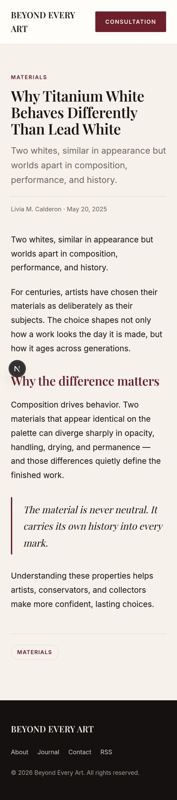 | 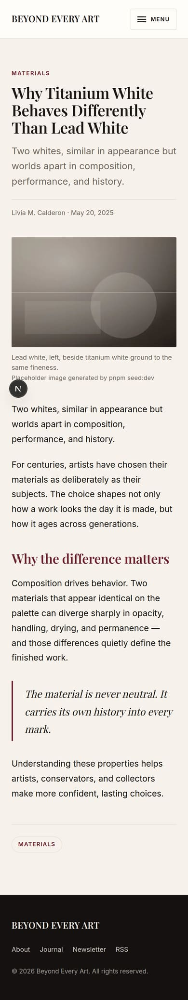 |

### Tag archive — desktop

| Before                                                                                       | After                                                                                                                             |
| -------------------------------------------------------------------------------------------- | --------------------------------------------------------------------------------------------------------------------------------- |
| 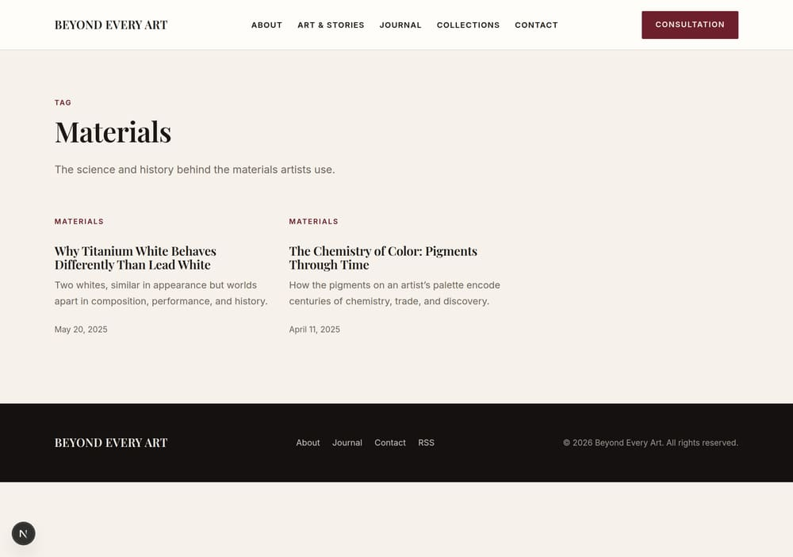 | 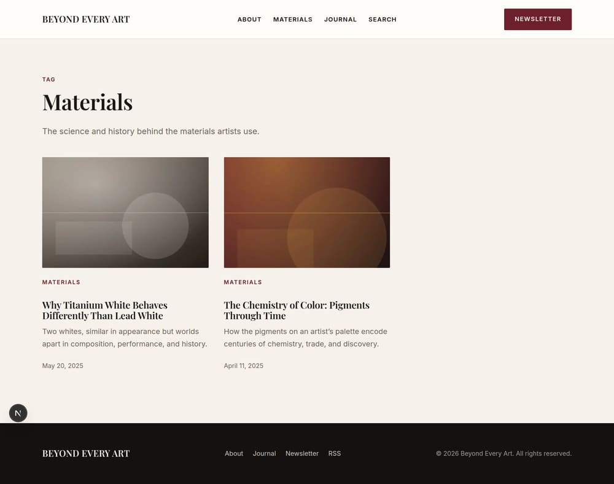 |

## 2. The card thumbnail placeholder silently collapsed

`.story-card__thumb` was a ``. An inline box ignores `aspect-ratio`, so its
gradient painted nothing at any size. It is now the block-level frame that holds
the image, and the same gradient is the placeholder for a story with no featured
image — visible as the "Building Texture" card in the "after" shots above, which
is seeded without an image on purpose.

## 3. Mobile had no navigation

Below 800px `.site-nav` is hidden with no alternative, so only the wordmark and
one button remained and every nav destination was unreachable.

| Before                                                                                                                                                                                            | After — closed                                                                                                                                 | After — open                                                                                                                                                                       |
| ------------------------------------------------------------------------------------------------------------------------------------------------------------------------------------------------- | ---------------------------------------------------------------------------------------------------------------------------------------------- | ---------------------------------------------------------------------------------------------------------------------------------------------------------------------------------- |
| 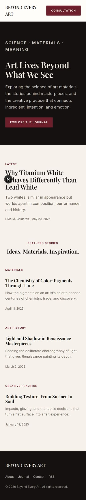 | 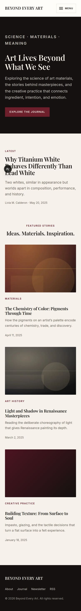 | 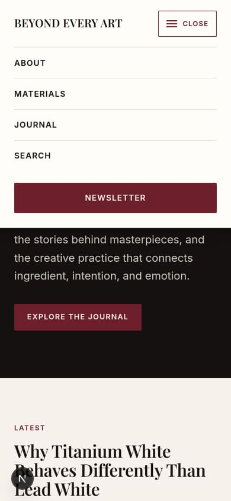 |

Keyboard behaviour verified end to end: Tab reaches the toggle, Enter opens it
and flips `aria-expanded` to `true`, Tab moves into the panel, Escape closes it
and returns focus to the button, following a link navigates and leaves it
closed, and above the breakpoint both the button and the panel leave the
accessibility tree entirely.

## 4. Nav links pointed at pages that do not exist

`/journal`, `/collections` and `/contact` all 404'd, and the hero call to action
hardcoded `/journal`. `/journal` is now a real paginated archive.

### `/journal` — desktop

| Before                                                                                    | After                                                                                                                                                                               |
| ----------------------------------------------------------------------------------------- | ----------------------------------------------------------------------------------------------------------------------------------------------------------------------------------- |
| 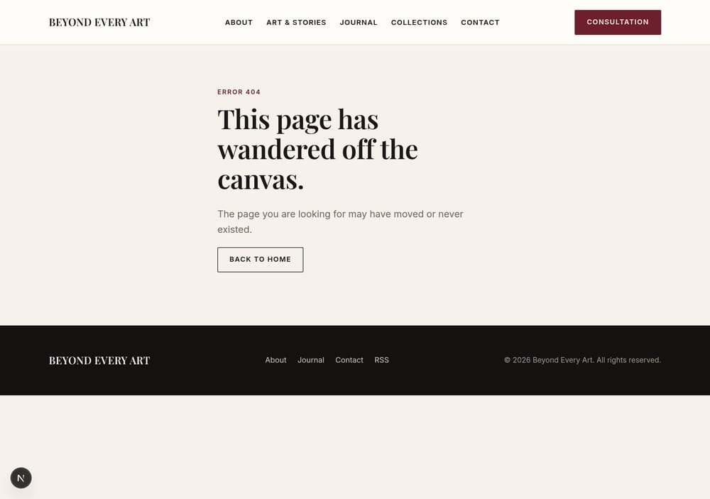 | 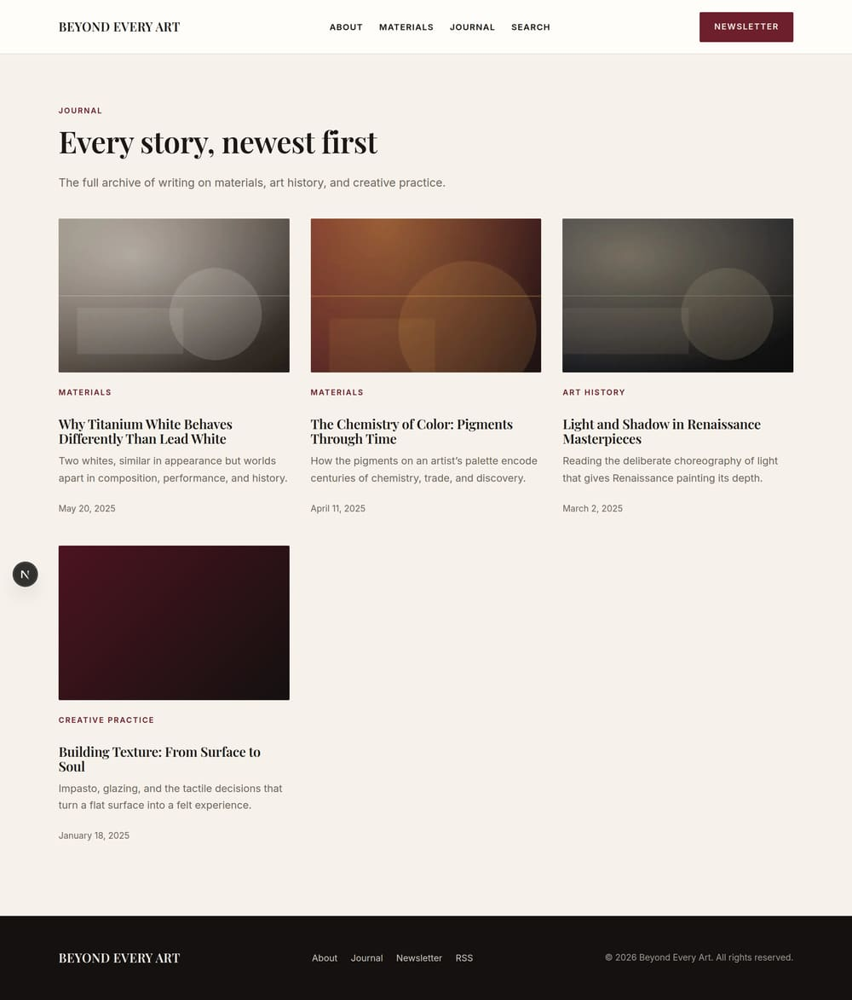 |

### `/journal` — mobile

| Before                                                                                  | After                                                                                                            |
| --------------------------------------------------------------------------------------- | ---------------------------------------------------------------------------------------------------------------- |
| 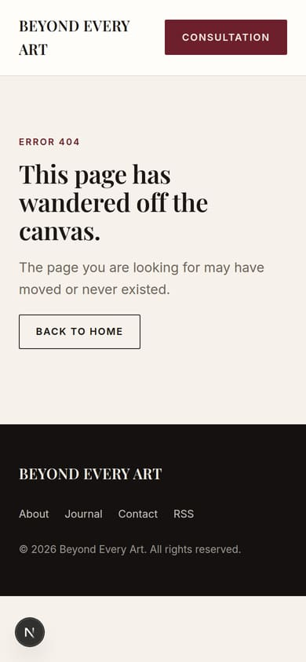 | 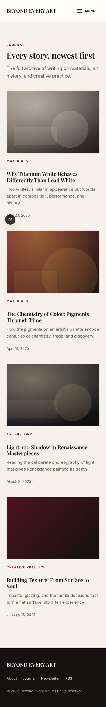 |

### Pagination

Exercised by temporarily seeding 14 posts, since the default seed produces four.
Those extra posts were removed again afterwards.

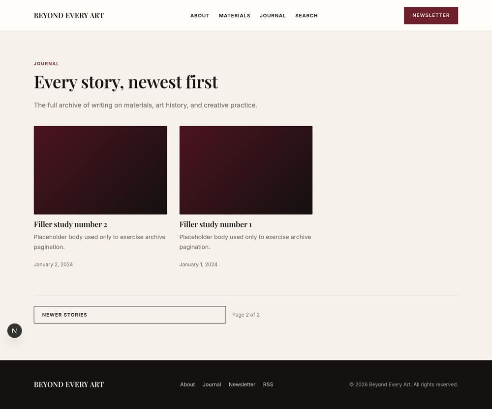
