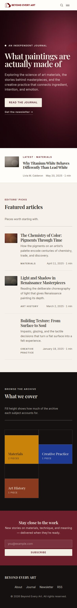
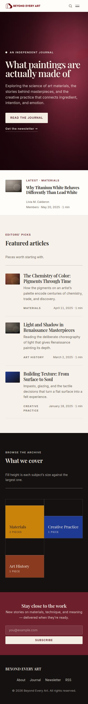
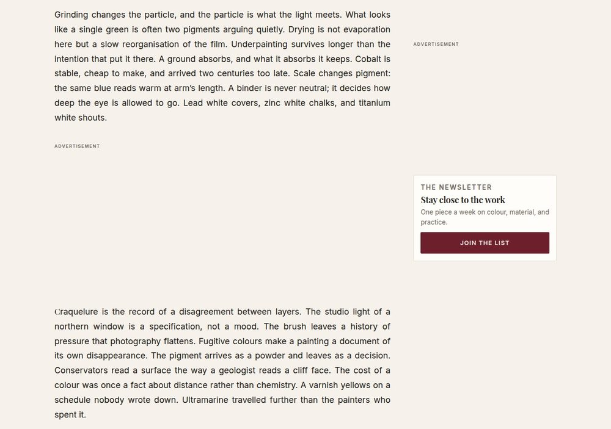
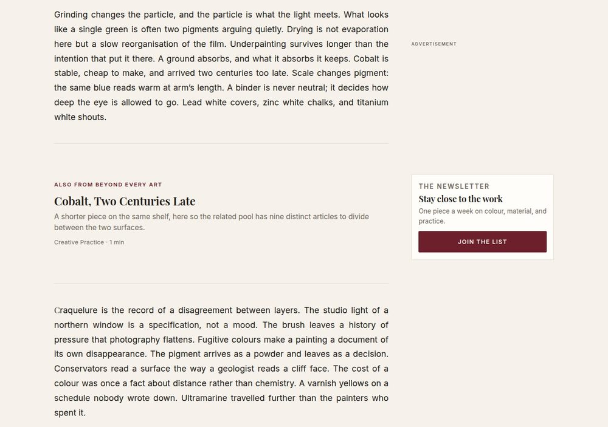
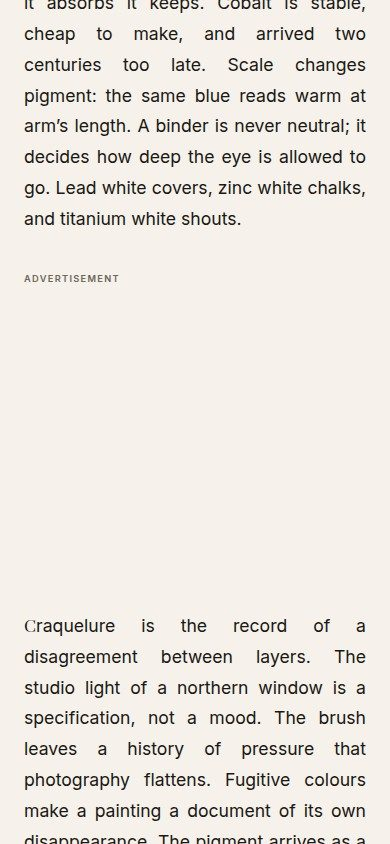
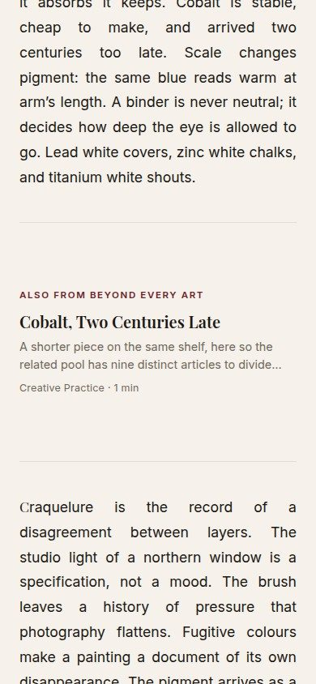
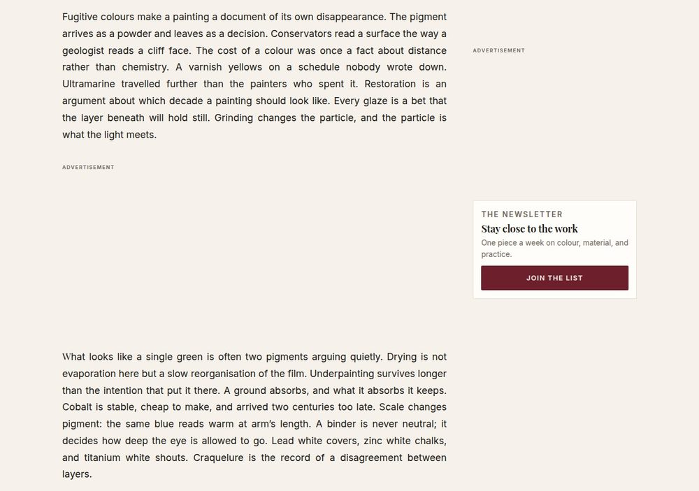
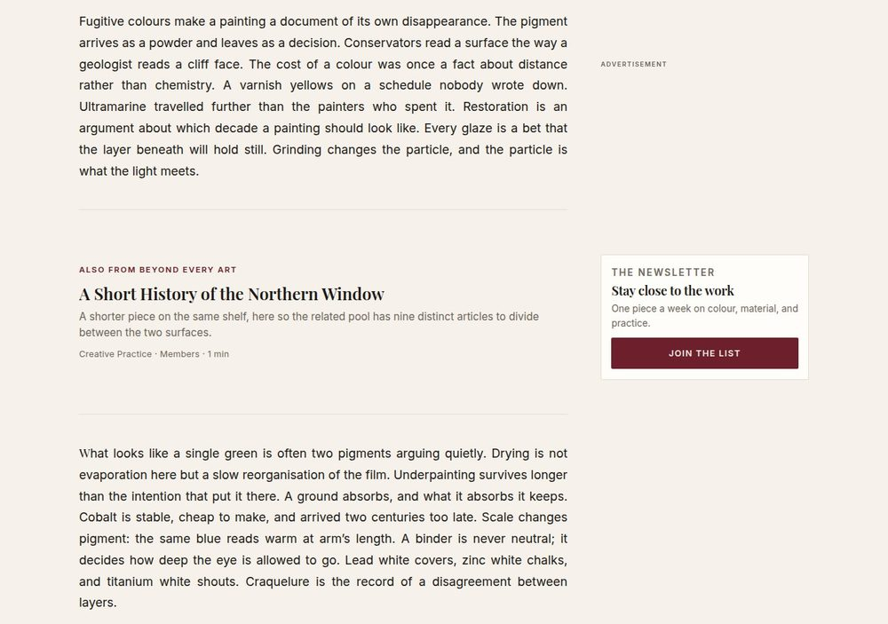

# Frontend gap fixes — before and after

Visual evidence for the frontend gaps fixed alongside these images. Every shot
is the seeded development site (`pnpm seed:dev`) captured in Chromium at 1280px
and 390px. Full page, except where a section says otherwise and why — section 6
is viewport-height, because its subject is 280px of a 27,000px article.

---

## 1. Featured images were never displayed

`article.tsx` and `post-list.tsx` contained no `` at all, so post pages and
every list and grid rendered text-only even though the migration preserves
featured images and alt text.

### Home page — desktop

| Before                                                                                                                                                                                         | After                                                                                                                                                                                                           |
| ---------------------------------------------------------------------------------------------------------------------------------------------------------------------------------------------- | --------------------------------------------------------------------------------------------------------------------------------------------------------------------------------------------------------------- |
|  |  |

### Post page — desktop

| Before                                                                                                                                                      | After                                                                                                                                                                                     |
| ----------------------------------------------------------------------------------------------------------------------------------------------------------- | ----------------------------------------------------------------------------------------------------------------------------------------------------------------------------------------- |
|  |  |

### Post page — mobile

| Before                                                                                     | After                                                                                                                                                |
| ------------------------------------------------------------------------------------------ | ---------------------------------------------------------------------------------------------------------------------------------------------------- |
|  |  |

### Tag archive — desktop

| Before                                                                                       | After                                                                                                                             |
| -------------------------------------------------------------------------------------------- | --------------------------------------------------------------------------------------------------------------------------------- |
|  |  |

## 2. The card thumbnail placeholder silently collapsed

`.story-card__thumb` was a ``. An inline box ignores `aspect-ratio`, so its
gradient painted nothing at any size. It is now the block-level frame that holds
the image, and the same gradient is the placeholder for a story with no featured
image — visible as the "Building Texture" card in the "after" shots above, which
is seeded without an image on purpose.

## 3. Mobile had no navigation

Below 800px `.site-nav` is hidden with no alternative, so only the wordmark and
one button remained and every nav destination was unreachable.

| Before                                                                                                                                                                                            | After — closed                                                                                                                                 | After — open                                                                                                                                                                       |
| ------------------------------------------------------------------------------------------------------------------------------------------------------------------------------------------------- | ---------------------------------------------------------------------------------------------------------------------------------------------- | ---------------------------------------------------------------------------------------------------------------------------------------------------------------------------------- |
|  |  |  |

Keyboard behaviour verified end to end: Tab reaches the toggle, Enter opens it
and flips `aria-expanded` to `true`, Tab moves into the panel, Escape closes it
and returns focus to the button, following a link navigates and leaves it
closed, and above the breakpoint both the button and the panel leave the
accessibility tree entirely.

## 4. Nav links pointed at pages that do not exist

`/journal`, `/collections` and `/contact` all 404'd, and the hero call to action
hardcoded `/journal`. `/journal` is now a real paginated archive.

### `/journal` — desktop

| Before                                                                                    | After                                                                                                                                                                               |
| ----------------------------------------------------------------------------------------- | ----------------------------------------------------------------------------------------------------------------------------------------------------------------------------------- |
|  |  |

### `/journal` — mobile

| Before                                                                                  | After                                                                                                            |
| --------------------------------------------------------------------------------------- | ---------------------------------------------------------------------------------------------------------------- |
|  |  |

### Pagination

Exercised by temporarily seeding 14 posts, since the default seed produces four.
Those extra posts were removed again afterwards.

---

## 5. Homepage modules: imageless plates, curated picks, and the topics chart

Four changes to `app/(frontend)/page.tsx` and what feeds it. Same capture
conditions as above — seeded development site, Chromium, 1280px and 390px, full
page — with `prefers-reduced-motion` forced so the cover's canvas is a still
frame and the reveal modules have settled.

### Home page — desktop

| Before                                                                                                                                                                                                                                                                                                          | After                                                                                                                                                                                                                                                                                                         |
| --------------------------------------------------------------------------------------------------------------------------------------------------------------------------------------------------------------------------------------------------------------------------------------------------------------- | ------------------------------------------------------------------------------------------------------------------------------------------------------------------------------------------------------------------------------------------------------------------------------------------------------------- |
|  |  |

### Home page — mobile

| Before                                                                                                                                                               | After                                                                                                                                                     |
| -------------------------------------------------------------------------------------------------------------------------------------------------------------------- | --------------------------------------------------------------------------------------------------------------------------------------------------------- |
|  |  |

### What these shots do and do not show

**The plate wash** is the clearest difference: "Building Texture" is seeded
without a featured image on purpose, and the pigment it takes is its subject's —
the same blue as the Creative Practice swatch further down the page. The first
pass of this change rendered nothing at all here, because `.entry__thumb` used
the `background` shorthand and reset the `background-image` the wash sets. Only
the screenshot caught it; `tests/design/plate-wash.test.ts` now catches it.

**The membership badge** on the Latest band appears because the seeded newest
post was set to `members` for the capture. It is public in the seed as shipped.

**The topics note** changes wording because the old claim was not true: the fill
has a 30% floor and a fifth of published posts carry no tag.

**The curation order is not visible here, and cannot be from this seed.** The
development seed has four posts, three of them flagged `featured`, and they are
also the three newest — so the tier chain and reverse-chronological order
produce the same list. What the shots do show is that the Latest band's piece
no longer repeats below it. The tiers themselves are covered by
`tests/content/homepage-picks.test.ts`, which is where the behaviour is pinned;
against the production archive the section becomes three flagged pieces followed
by three recent ones.

**The topics chart shows three swatches because the seed has three tags.** The
change that lifts the limit is only observable against a library with more
subjects than the old cap of six — production has eight after the workflow tag
is dropped.

**The footer carries links here because the seed populates the `footer` global.**
It is empty in production, where the footer renders as the wordmark and the
copyright line alone.

---

## 6. In-article ad slots showed a labelled empty box

`body.tsx` rendered `<AdUnit placement="article-inline" />` with no children in
both body branches, so every in-body slot an ad did not fill was an
"Advertisement" cap over ~280px of paper. The rail's box has held house content
since the slot layer shipped; these six did not. Each now carries one related
article — the tail of the pool "Read next" takes its three from, so no two
slots show the same piece and none repeats what closes the article.

Capture conditions differ from the sections above in two ways, both forced by
what is being photographed:

- **Not full page.** The article seeded for these is 5,958 words and roughly
  27,000px tall, in which a 280px box is invisible. These are viewport shots at
  1280×900 and 390×844, scrolled to centre a slot, so the band is seen with the
  body copy either side of it.
- **A temporarily seeded long article.** `pnpm seed:dev` writes ~130-word
  bodies and the first in-body unit lands at 400 words, so the seeded site
  renders no in-article slot at all and there is nothing to photograph. One
  article at the production mean plus nine short companions — enough for the
  pool to supply nine distinct pieces — were seeded for the capture and removed
  again, the same way section 4's pagination shots were taken.

The ad client is the committed default and no ad is served, which is the
ordinary local state: the loader never resolves, `data-ad-status` never
arrives, and the three-second guess settles the slot as unfilled. That is the
same path a reader running a blocker takes, and it is the commonest reason a
box is empty.

### First slot — desktop

| Before                                                                                                                                                                       | After                                                                                                                                                                                                                                           |
| ---------------------------------------------------------------------------------------------------------------------------------------------------------------------------- | ----------------------------------------------------------------------------------------------------------------------------------------------------------------------------------------------------------------------------------------------- |
|  |  |

### First slot — mobile

| Before                                                                                                                                           | After                                                                                                                                                                                  |
| ------------------------------------------------------------------------------------------------------------------------------------------------ | -------------------------------------------------------------------------------------------------------------------------------------------------------------------------------------- |
|  |  |

### Second slot — desktop

The point of this pair: the next slot down the same article carries a
different piece, and its meta line shows the membership marker where the piece
is gated.

| Before                                                                                                                                                 | After                                                                                                                                                                                                                                    |
| ------------------------------------------------------------------------------------------------------------------------------------------------------ | ---------------------------------------------------------------------------------------------------------------------------------------------------------------------------------------------------------------------------------------- |
|  |  |

### What these shots do and do not show

**The rail's box is empty in every frame, before and after, and that is not
this change.** The seeded Site Settings leave "Article rail — when no ad is
shown" set to nothing, which is a real operator choice and renders exactly what
it says. Set it to an article or an app and the rail's box fills the way
`pnpm measure:rail --unfilled` shows.

**Six slots is the cap, not the count.** This article draws all six because it
is 5,958 words. The archive's mean does the same; a short piece takes three.

**The air inside the band is the box, not the design.** The type comes to about
165px in a box that is 296, because the reservation belongs to the ad rather
than to the promo. An earlier build pinned the meta line to the bottom rule and
left the whole difference as one hole under the standfirst; centring it is what
these shots show.
