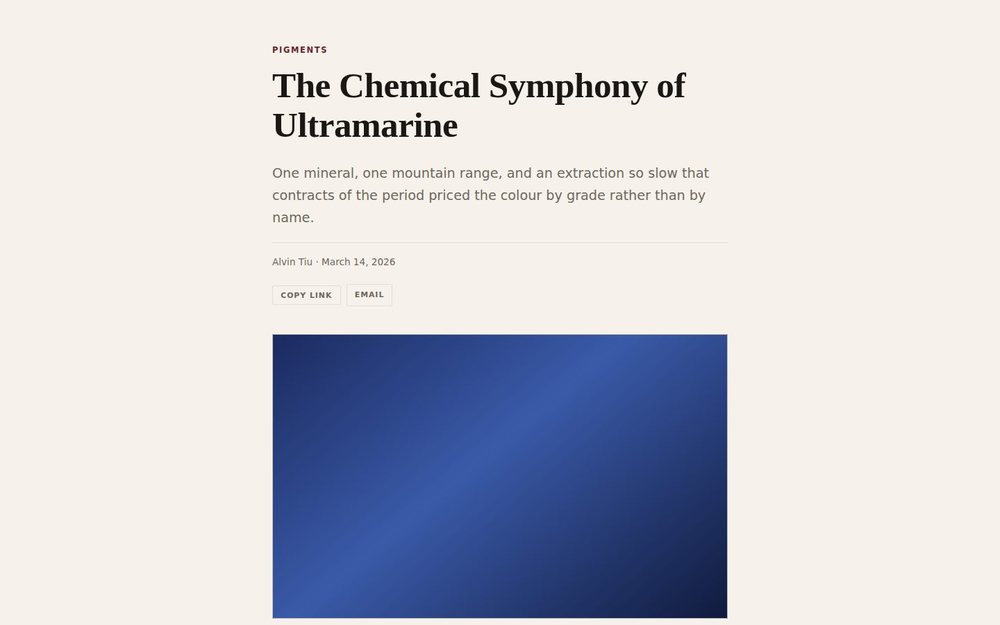
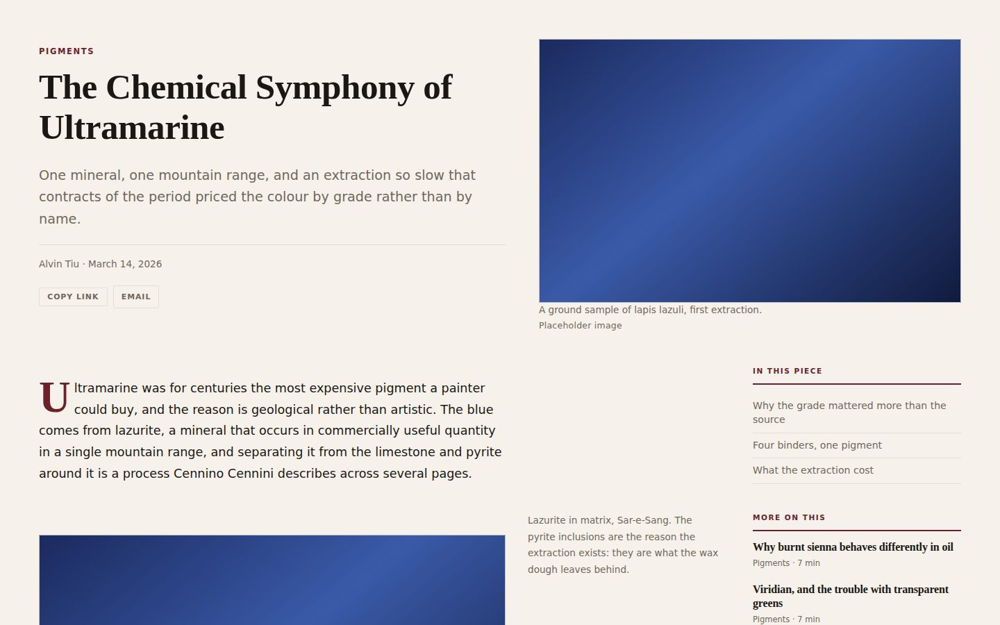
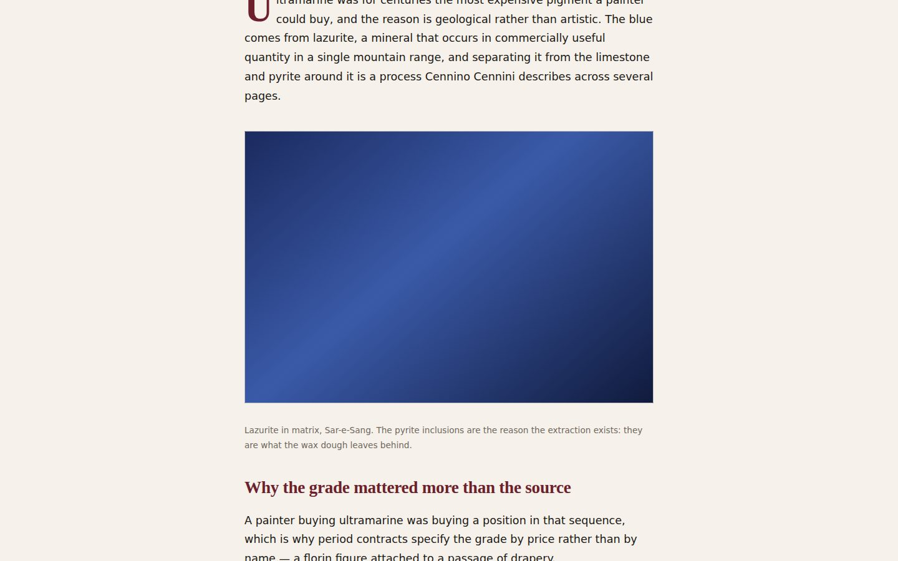
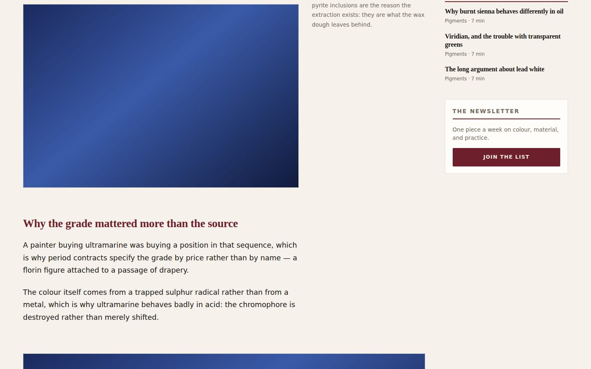

# Post layout — before and after

Evidence for the three-track post template described in
[`../../POST_PAGE_LAYOUT.md`](../../POST_PAGE_LAYOUT.md).

Every shot is the `Article` component rendered to static markup with the real
`app/globals.css`, captured in Chromium at 1440×900 and 390×844. The copy is
sample content and the images are placeholder gradients — the media server is
not running in the harness, and the point of these is the geometry.

One difference from a real page: the component's entrance animations ship
`opacity: 0` in server markup and this page never hydrates, so the capture
neutralises that. Nothing else is overridden.

## 1440 — the first screen

| Before                                                                                                                                                                                                                       | After                                                                                                                                                                                                                                           |
| ---------------------------------------------------------------------------------------------------------------------------------------------------------------------------------------------------------------------------- | ----------------------------------------------------------------------------------------------------------------------------------------------------------------------------------------------------------------------------------------------- |
|  |  |

The first paragraph starts 1009px down the page before and 569px after.

## 1440 — the body

| Before                                                                                                                   | After                                                                                                                                                                                                           |
| ------------------------------------------------------------------------------------------------------------------------ | --------------------------------------------------------------------------------------------------------------------------------------------------------------------------------------------------------------- |
|  |  |

## 390

Unchanged. The rail is hidden below 1280 and nothing widens there, so a phone
gets the template it already had.
