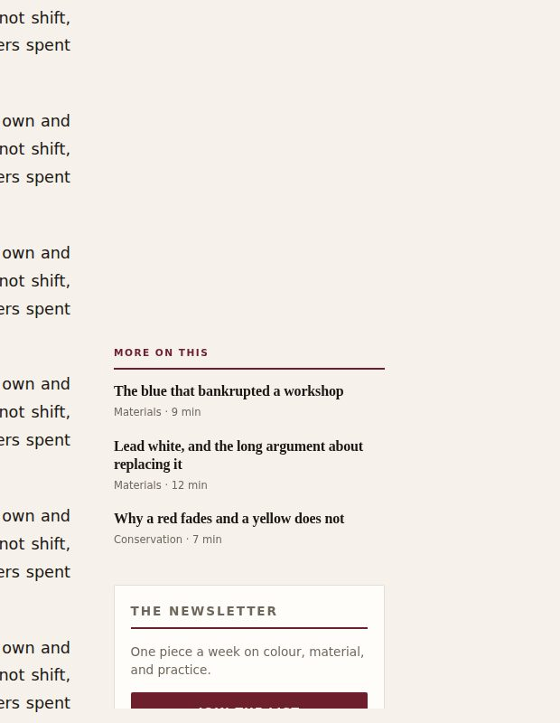
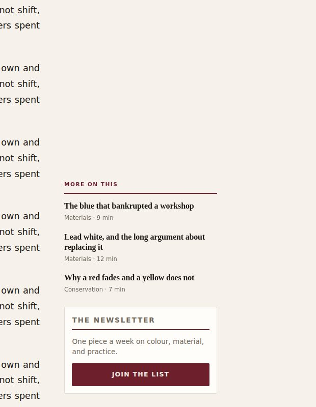

# Post layout — before and after

Evidence for the three-track post template described in
[`../../POST_PAGE_LAYOUT.md`](../../POST_PAGE_LAYOUT.md).

Every shot is the `Article` component rendered to static markup with the real
`app/globals.css`, captured in Chromium at 1440×900 and 390×844. Both sides are
the same article — a real published piece, "Why Titanium White Behaves
Differently Than Lead White" — so the pair differs only in the template. The
images are placeholder gradients: the media server is not running in the
harness, and the point of these is the geometry.

One difference from a real page: the component's entrance animations ship
`opacity: 0` in server markup and this page never hydrates, so the capture
neutralises that. Nothing else is overridden.

## 1440 — the first screen

| Before                                                                                                                                                                                                                       | After                                                                                                                                                                                                                                                            |
| ---------------------------------------------------------------------------------------------------------------------------------------------------------------------------------------------------------------------------- | ---------------------------------------------------------------------------------------------------------------------------------------------------------------------------------------------------------------------------------------------------------------- |
|  |  |

The first paragraph starts 1009px down the page before and 569px after.

The empty band in the rail under the contents list is deliberate: it is the
250px reserved for the square ad unit, which renders nothing until there is an
ad layer to fill it.

## 1440 — the body

| Before                                                                                           | After                                                                                                                                                                                                                                 |
| ------------------------------------------------------------------------------------------------ | ------------------------------------------------------------------------------------------------------------------------------------------------------------------------------------------------------------------------------------- |
|  |  |

## 1440x800 — the sticky group on a short window

A different harness from the shots above: the real `app/globals.css` and the
real markup of `ArticleRail`, at a viewport 800px tall, scrolled far enough for
the group to be pinned. Only the stylesheet differs between the pair. The crop
is the rail and a slice of the column beside it.

| Before                                                                                                                                                                                                    | After                                                                                                                                                                                                                          |
| --------------------------------------------------------------------------------------------------------------------------------------------------------------------------------------------------------- | ------------------------------------------------------------------------------------------------------------------------------------------------------------------------------------------------------------------------------ |
|  |  |

800px of viewport is a 1440x900 laptop with the browser chrome taken off. The
group was 737px before and the cap 692px, so 45px of it had nowhere to go — and
the card, being last, is what went.

After, two things changed. The related list is the only module allowed to
shrink, so the card can no longer be the thing that gives; and the group's
spacing was tightened by 37px, which is why at this height nothing has to give
at all — the group is 686px against a 700px cap, so all three pieces and the
whole card fit with no scrolling. On a shorter window the list is what absorbs
the difference, down to 650px of viewport where it is dropped instead.

## 390

The rail is hidden below 1280, so a phone gets the template it already had —
with the column at 704px rather than 656 where the screen allows, and the same
justified body text.
